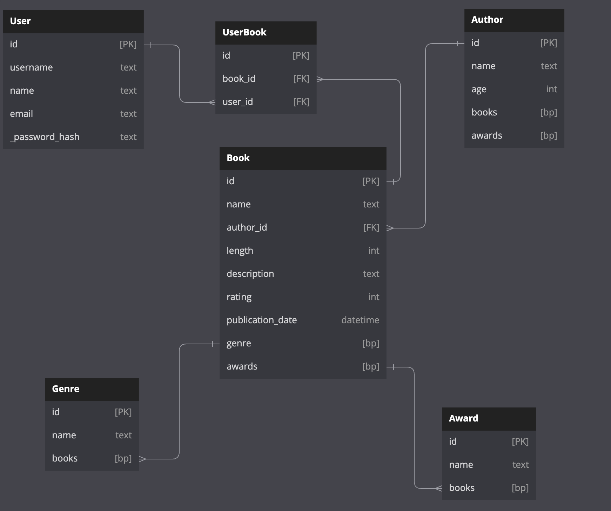
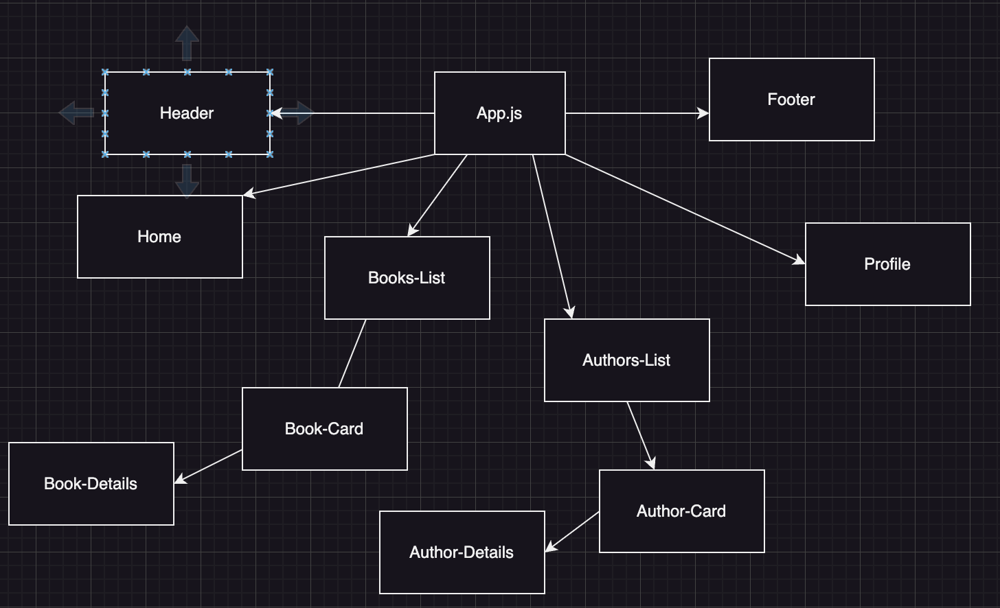
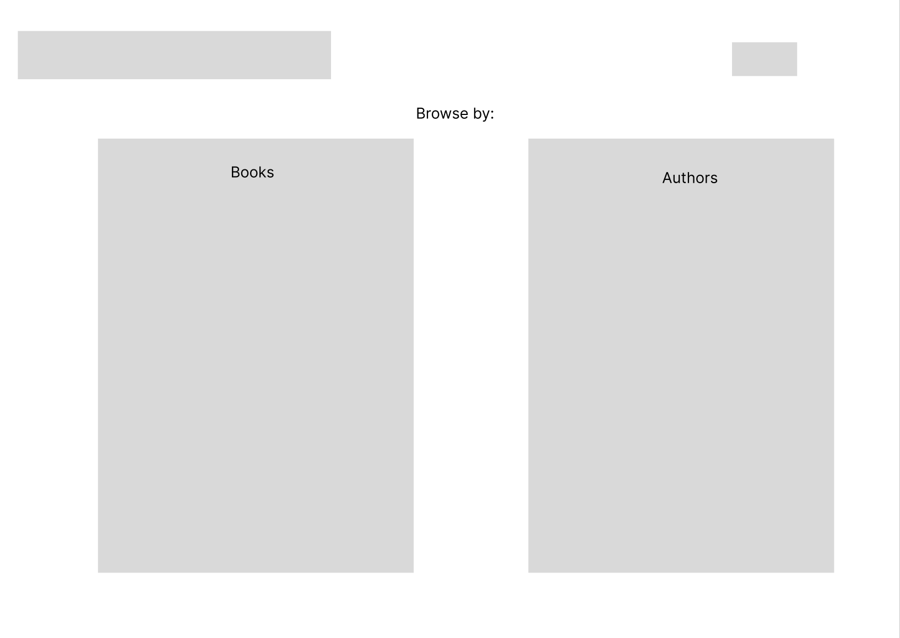
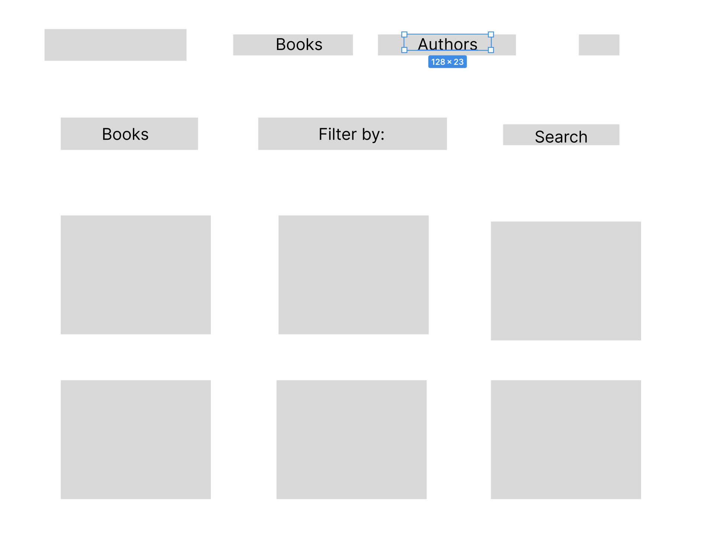
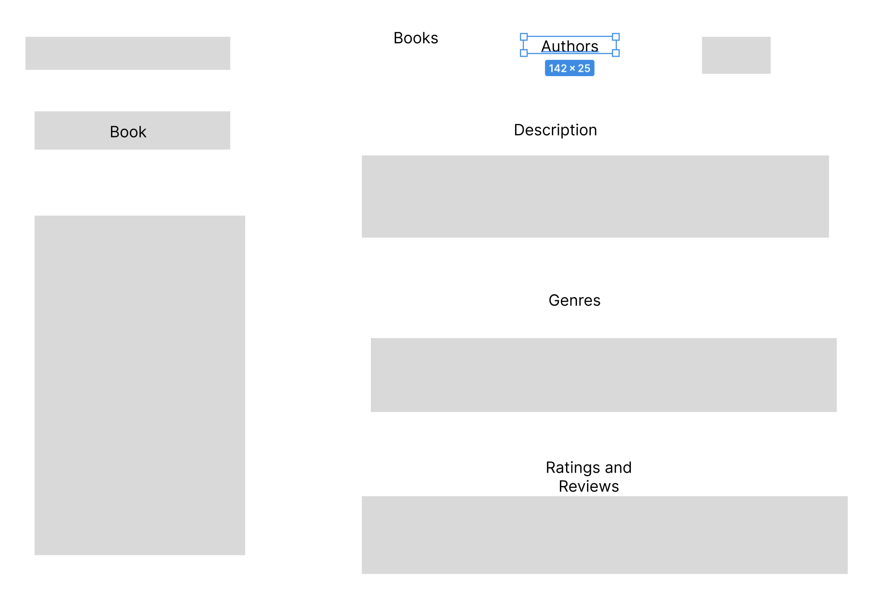
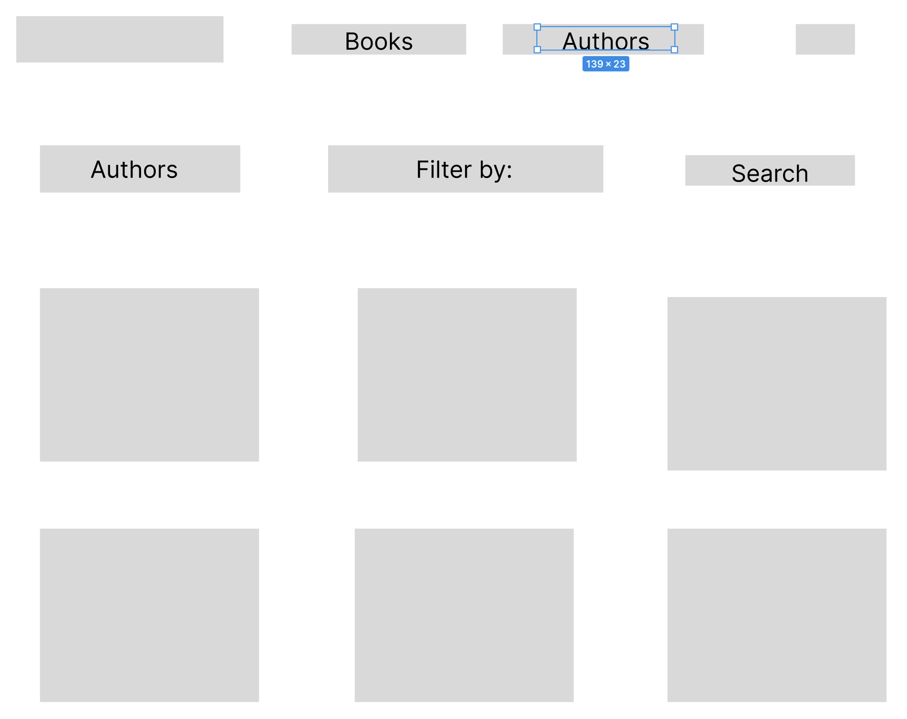
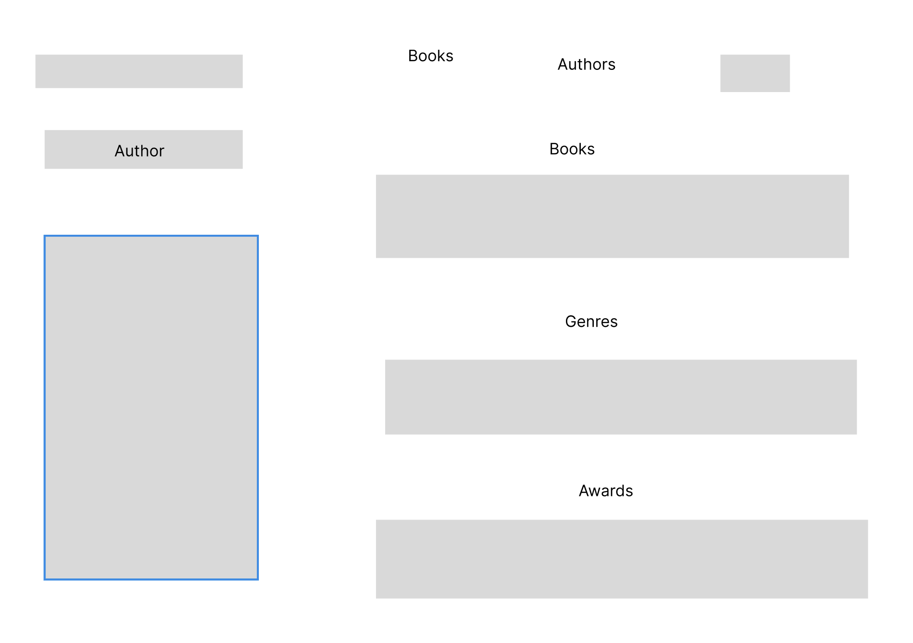
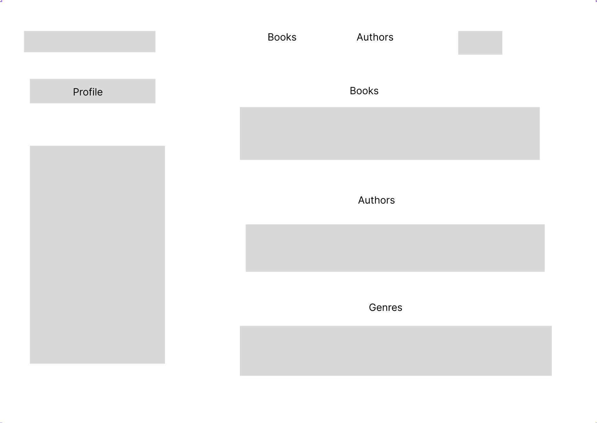

# Librarified

Librarified is a book collection website. On the site you will be able to view books from different authors. 

# User Stories
1. User will be able to browse through books 
3. User will be able to browse through authors 
4. User will be able to add, edit and delete books of their choice

# Stretch Goals
1. User will be able to favorite books and see their favorites on their profile
2. User will be able to make and account or login as a user
3. Reading list where user can keep track of books to read next

# Models

# API Endpoints

| API Route     | HTTP Verb | Purpose           | Deliverable |
|---------------|-----------|-------------------|-------------|
| /books        | Get       | Get all books     | core        |
| /books        | Post      | Post a new book   | core        |
| /books/{id}   | Get       | Get a book        | core        |
| /books/{id}   | Patch     | Edit a book       | core        |
| /books/{id}   | Delete    | Delete a book     | core        |
| /authors      | Get       | Get all authors   | core        |
| /authors      | Post      | Post a new author | core        |
| /authors/{id} | Get       | Get an author     | core        |
| /authors/{id} | Patch     | Edit an author    | core        |
| /authors/{id} | Delete    | Delete an author  | core        |
| /genres       | Get       | Get all genres    | core        |
| /reviews      | Get       | Get all reviews   | core        |
| /reviews      | Post      | Post new review   | core        |
| /reviews/{id} | Get       | Get a review      | core        |
| /reviews/{id} | Patch     | Edit a review     | core        |
| /reviews/{id} | Delete    | Delete a review   | core        |
| /awards       | Get       | Get all awards    | core        |
| /awards/{id}  | Get       | Get an award      | core        |
| /user/books   | Get       | Get user's books  | core        |
| /user/books   | Post      |Post new user book | core        |
| /user/books/{id} | Delete | Delete user book  | core        |

# Client Routes 

| Client Route  | Component           |
|---------------|---------------------|
| /             | Home.jsx            |
| /books        | Books.jsx           |
| /books/{id}   | Book-Details.jsx    |
| /authors      | Authors.jsx         |
| /authors/{id} | Authors-Details.jsx |
| /profile      | Profile.jsx         |
| /add_book     | AddBook.jsx         |
|/edit_book/{id}| EditBook.jsx        |
| /process      | SignUp-Login.jsx    |

# React Tree

# Wireframes

